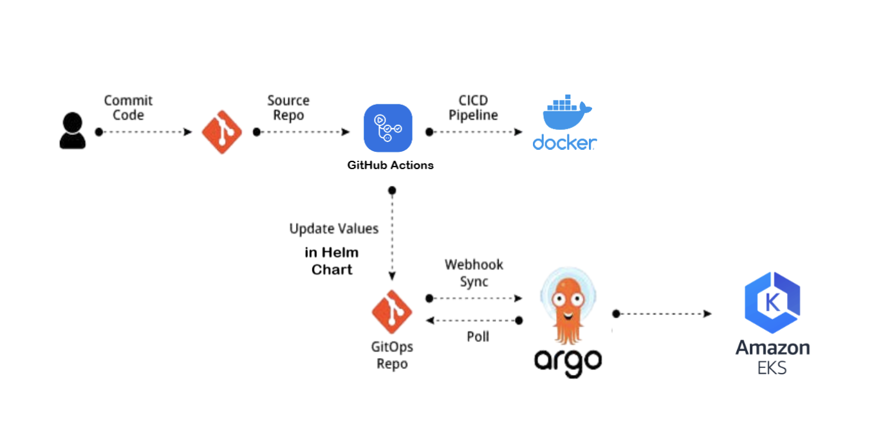
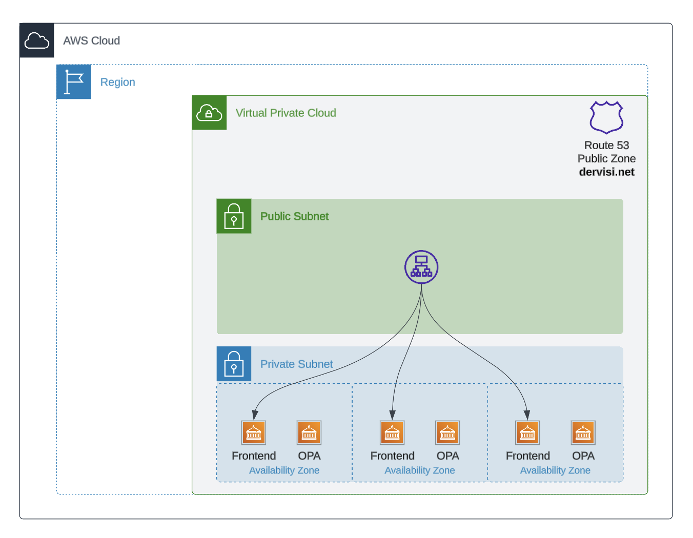
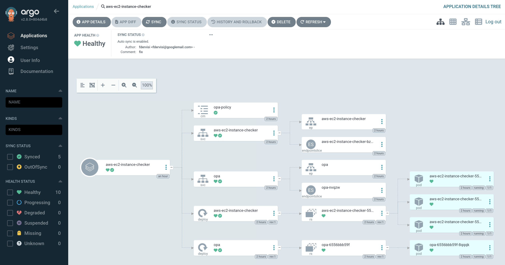
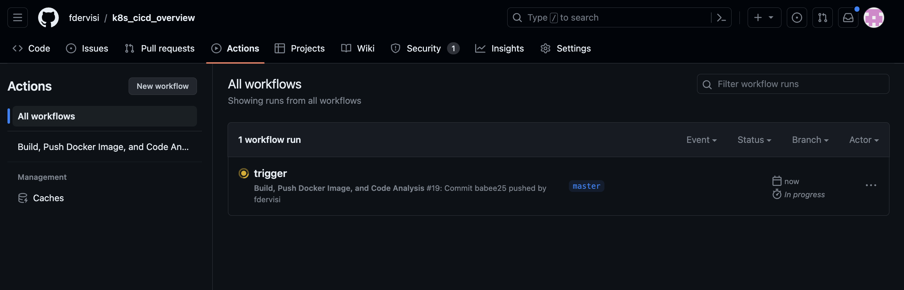
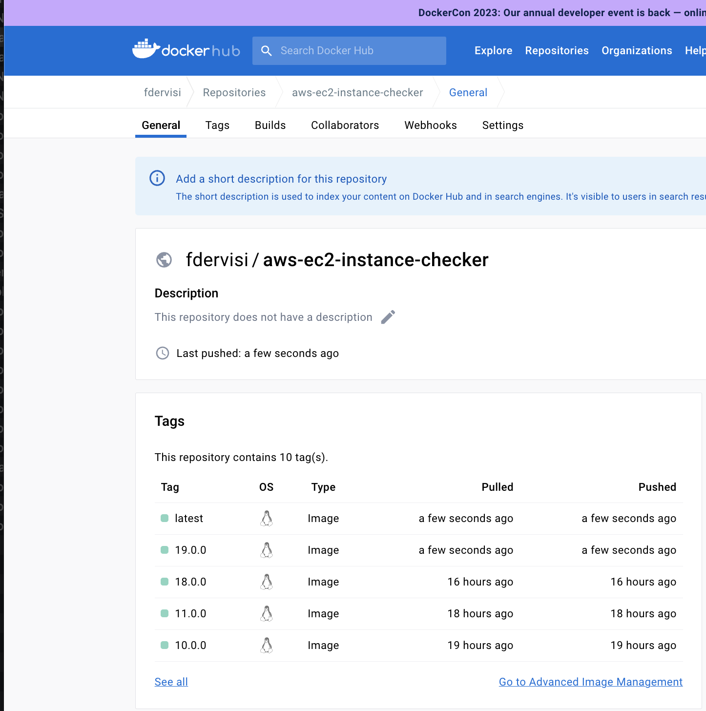

# GitOps in Action: Mastering CI/CD with Microservice-Based Applications

In the dynamic world of DevOps, integrating cloud resources with Continuous Integration and Continuous Deployment (CI/CD) is more than just a trend—it's a significant shift. With this guide, I aim to provide a deep dive into this evolution, spotlighting the Flask-powered AWS EC2 Instance Checker as our illustrative microservice application. This tool is structured as a two-tier web application. Crucially, it employs an [OPA](https://www.openpolicyagent.org/docs/latest/) (Open Policy Agent) server, a general-purpose policy engine that enables unified, context-aware policy enforcement across the entire stack. With the OPA server, the application can conduct a range of validations against AWS resources, ensuring that operations align with predefined policies and best practices.

Central to this journey is a straightforward end-to-end pipeline I've designed. For the Continuous Integration (CI) phase, it actively scans the code for vulnerabilities, build a Docker image, and then uploads it to the repository. Following this, the Continuous Deployment (CD) phase takes over: ArgoCD monitors the Kubernetes deployment, and if any configuration or image changes are detected, it seamlessly deploys the updates to the cluster.

While the AWS EC2 Instance Checker application offers hands-on insights, my primary goal is to shine a light on modern DevOps tools and practices. Adopting a "Learn by Doing" approach, I delve into microservice architectures, CI/CD mechanics, GitOps, and the art of effective pipeline construction.

If you're an architect keen on understanding the nuances of the current DevOps landscape, or an engineer eager to develop robust pipelines, this guide is tailored just for you.



---

## Tool Alternatives

In the expansive DevOps landscape, numerous tools have emerged over time. While some lead the pack, others stand out with specialized features tailored to particular requirements. Below is a list of alternatives to the main tools emphasized in this guide:

1. **Alternatives to GitHub Actions**:
   - **Jenkins**: An open-source automation powerhouse for building, deploying, and automating projects.
   - **GitLab CI/CD**: GitLab's own take on continuous integration and deployment.
   - **CircleCI**: A robust CI/CD platform with Docker and Kubernetes support.
   - **Travis CI**: A cloud service that dovetails neatly with GitHub repositories.

2. **Alternatives to Argo CD**:
   - **Flux**: A GitOps tool tailored for Kubernetes, birthed by Weaveworks.
   - **Jenkins X**: Zeroes in on CI/CD for cloud-ready applications on Kubernetes.
   - **Spinnaker**: A versatile platform for multi-cloud continuous delivery.

3. **Alternatives to Helm**:
   - **Kustomize**: Customizes Kubernetes objects via a unique kustomization file.
   - **Skaffold**: Manages the workflow for crafting, pushing, and deploying applications in Kubernetes.
   - **Terraform**: A code-first approach to provisioning Kubernetes resources.

4. **Alternatives to Docker Hub**:
   - **Quay.io**: Red Hat's answer to container image registry needs.
   - **Google Container Registry (GCR)**: Google's dedicated container image storage.
   - **Amazon Elastic Container Registry (ECR)**: AWS's take on a Docker container registry.

Exploring these alternatives empowers teams to make decisions rooted in project needs, existing toolchains, or even personal preference. The dynamic world of DevOps tools ensures a fit for every requirement, and sometimes, blending tools from varied ecosystems can craft an optimal workflow.

---

## Exploring the AWS EC2 Instance Checker

Constructed using Python and Flask, the AWS EC2 Instance Checker is a 2-tier web application that leverages an OPA server to validate against AWS resources. For scalability, the frontend has 3 deployments and is publicly accessible. For security purposes, the OPA server communicates internally within the cluster. It offers the following features:

- **View EC2 Instances**: Easily fetch and display all your AWS EC2 instances.
- **Inspect Instance Details**: Get in-depth information about any selected instance.
- **Upgrade Metadata Service**: With a simple click, transition your instances to IMDSv2.
- **Check Metadata Service Version**: Monitor the metadata service version of your instances effortlessly.



---

## Modern CI/CD Tools: Working in Harmony

Any microservice-based application shines brightest when integrated with leading CI/CD tools. Here's a deep dive into each tool's role:

### 1. GitHub Actions: Automating Workflows with Precision

GitHub Actions streamlines software workflows right within GitHub. For our AWS EC2 Instance Checker, any modifications to the `main` branch activate GitHub Actions. It then assembles a Docker image and dispatches it to DockerHub.

### 2. Argo CD & Argo CD Image Updater: Orchestrating Kubernetes Deployments

Argo CD, a GitOps gem for Kubernetes, ensures the desired application state (defined in Git) matches the actual state in the Kubernetes cluster. Paired with Argo CD Image Updater, these two ensure smooth deployments and synchronization of Kubernetes manifests with the freshest Docker images.

### 3. Helm: Simplifying Kubernetes Deployments

Helm, dubbed the package manager for Kubernetes, demystifies deployment complexities. For our application, Helm charts detail the Kubernetes resources, empowering Argo CD to oversee and refresh the deployment seamlessly.

---

## The Symphony of Deployment

Navigating the buzzwords like CI/CD, ArgoCD, GitHub Actions, and Helm can be daunting. But fear not, we're here to simplify! Let's break down the process:

1. **Initialization**: ArgoCD initializes the Helm deployment in Kubernetes, designating GitHub as the primary source.
2. **Commit & Build**: When a developer commits Python code, GitHub Actions springs into action, building a container and pushing it to Docker Hub.
3. **Monitor & Update**: Argo CD Image Updater watches GitHub. Upon spotting a new container version, it updates the Helm charts, resulting in a refreshed Kubernetes deployment.

This cyclical process ensures that GitHub remains the central reference point, keeping everything in sync.

**For Architects**: Armed with this overview, you can grasp the intricate relationships and the flow of CI/CD. This knowledge equips you to strategize for efficient deployment and scaling. If you're leaning towards high-level architecture, you might wrap up your reading here.

**For Hands-On DevOps Engineers**: Eager to dive into the nitty-gritty? Read on for detailed setup instructions and insights into building and managing this pipeline.

---

## Setting up Your DevOps Arsenal

Embarking on a DevOps adventure necessitates some groundwork. Whether you're a DevOps veteran or a beginner, this guide is designed to assist you in setting up essential tools.

### Introduction

We'll walk you through the setup of key tools like `kubectl`, `Helm`, `ArgoCD`, and more for your Linux system. Our goal is to offer straightforward and detailed instructions for both newcomers and seasoned professionals. If you've already set up tools like `kubectl` or have an existing cluster, feel free to skip those steps and jump to the sections relevant to you.

### Table of Contents

- [Installation Procedures](#installation-procedures)
    - [Installing kubectl](#installing-kubectl)
    - [Installing Helm](#installing-helm)
    - [Installing argocd CLI](#installing-argocd-cli)
    - [Installing ArgoCD](#installing-argocd)
    - [Setting up ArgoCD Image Updater](#setting-up-argocd-image-updater)
    - [Configuring GitHub Actions](#setting-up-github-actions)
- [Conclusion and Next Steps](#conclusion-and-next-steps)

### Installing `kubectl`

For a more detailed guide, you can consult the official Kubernetes documentation [here](https://kubernetes.io/docs/tasks/tools/install-kubectl-linux/).

1. **Prepare Your System**:
    ```bash
    sudo apt-get update
    sudo apt-get install -y ca-certificates curl
    ```

2. **Set up the Kubernetes apt Repository**:
    ```bash
    sudo mkdir /etc/apt/keyrings
    echo "deb [signed-by=/etc/apt/keyrings/kubernetes-archive-keyring.gpg] https://apt.kubernetes.io/ kubernetes-xenial main" | sudo tee /etc/apt/sources.list.d/kubernetes.list
    ```

3. **Install `kubectl`**:
    ```bash
    sudo apt-get update
    sudo apt-get install -y kubectl
    ```

### Adding Contexts to `kubeconfig` for `kubectl`

After installing `kubectl`, if you're managing multiple Kubernetes clusters, you'll benefit from setting up contexts for seamless switching.

1. **Prerequisites**:
    Verify `kubectl` installation:
    ```bash
    kubectl version
    ```

2. **Define a New Context**:

    First, detail the cluster:
    ```bash
    kubectl config set-cluster <CLUSTER_NAME> --server=<CLUSTER_ENDPOINT> --certificate-authority=<PATH_TO_CA>
    ```

    Then, input user credentials:
    ```bash
    kubectl config set-credentials <USER_NAME> --client-key=<PATH_TO_CLIENT_KEY> --client-certificate=<PATH_TO_CLIENT_CERT>
    ```

    Lastly, create the context:
    ```bash
    kubectl config set-context <CONTEXT_NAME> --cluster=<CLUSTER_NAME> --user=<USER_NAME>
    ```

3. **Verify the New Context**:
    Check the newly added context:
    ```bash
    kubectl config get-contexts
    ```

    If it's listed, activate it:
    ```bash
    kubectl config use-context <CONTEXT_NAME>
    ```

Maintain caution with your `kubeconfig` files, as they contain vital access details. By configuring multiple contexts, you can nimbly navigate different Kubernetes clusters.

---

### Installing Helm

For a comprehensive guide, you can refer to Helm's official documentation [here](https://helm.sh/docs/intro/install/).

1. **Set up the Helm Repository**:
    ```bash
    curl https://baltocdn.com/helm/signing.asc | gpg --dearmor | sudo tee /usr/share/keyrings/helm.gpg > /dev/null
    sudo apt-get install apt-transport-https --yes
    echo "deb [arch=$(dpkg --print-architecture) signed-by=/usr/share/keyrings/helm.gpg] https://baltocdn.com/helm/stable/debian/ all main" | sudo tee /etc/apt/sources.list.d/helm-stable-debian.list
    ```

2. **Install Helm**:
    ```bash
    sudo apt-get update
    sudo apt-get install helm
    ```

---

### Installing ArgoCD CLI

To manage ArgoCD more effectively, its Command Line Interface (CLI) comes in handy. For a comprehensive guide, refer to the ArgoCD official documentation [here](https://argo-cd.readthedocs.io/en/stable/getting_started/).

1. **Download the Latest ArgoCD Version**:
    ```bash
    curl -sSL -o argocd-linux-amd64 https://github.com/argoproj/argo-cd/releases/latest/download/argocd-linux-amd64
    ```

2. **Install ArgoCD CLI**:
    ```bash
    sudo install -m 555 argocd-linux-amd64 /usr/local/bin/argocd
    ```

3. **Cleanup**:
    ```bash
    rm argocd-linux-amd64
    ```

---

### Installing ArgoCD

For a detailed guide, consult ArgoCD's official documentation [here](https://argo-cd.readthedocs.io/en/stable/getting_started/).

1. **Set Up a Namespace for ArgoCD**:
    ```bash
    kubectl create namespace argocd
    ```

2. **Deploy ArgoCD in the Namespace**:
    ```bash
    kubectl apply -n argocd -f https://raw.githubusercontent.com/argoproj/argo-cd/stable/manifests/install.yaml
    ```

3. **Modify the `argocd-server` Service Type**:
    ```bash
    kubectl patch svc argocd-server -n argocd -p '{"spec": {"type": "LoadBalancer"}}'
    ```

4. **Retrieve the Initial Admin Password**:
    ```bash
    kubectl get secrets -n argocd argocd-initial-admin-secret -o yaml
    echo "<-secret-string->" | base64 -d
    ```

5. **Log in to ArgoCD**:
   
   Fetch the `EXTERNAL-IP`:
   ```bash
   kubectl get service -n argocd argocd-server
   ```
   
   Log in using the IP or hostname:
   ```bash
   sudo argocd login <ARGOCD_SERVER> --insecure
   ```

   Note: The `--insecure` flag disables certificate validation. It's useful for servers without trusted certificates but poses security risks. Always strive for a valid certificate in production setups.

6. **Confirm ArgoCD Installation**:
    ```bash
    argocd version
    ```

7. **Update the ArgoCD Password**:
    ```bash
    argocd account update-password
    ```

After completing these steps, ArgoCD should be up and running on your Kubernetes cluster. Customize the commands as needed based on your setup.

---

### Setting up ArgoCD Image Updater

For an in-depth guide, you can turn to ArgoCD's Image Updater official documentation [here](https://argocd-image-updater.readthedocs.io/en/stable/).

1. **Install ArgoCD Image Updater**:
    ```bash
    kubectl apply -n argocd -f https://raw.githubusercontent.com/argoproj-labs/argocd-image-updater/stable/manifests/install.yaml
    ```

2. **Set Logging Level for Diagnostics**:
   
   Modify the `argocd-image-updater-config` ConfigMap for your desired log level:
   ```yaml
   data:
     log.level: debug
   ```

3. **Verify the Operation**:
   
   Check the logs to ensure the Image Updater is running as expected:
   ```bash
   kubectl -n argocd logs argocd-image-updater-<POD_NAME>
   ```

4. **Authorize Image Updater for GitHub**:

   Store your GitHub credentials as environment variables. Create tokens in GitHub by following [this guide](https://docs.github.com/en/enterprise-server@3.6/authentication/keeping-your-account-and-data-secure/managing-your-personal-access-tokens):
   ```bash
   export GITHUB_USER=<YOUR_USERNAME>
   export GITHUB_TOKEN=<YOUR_GITHUB_TOKEN>
   ```

   Create the necessary Kubernetes secret:
   ```bash
   kubectl --namespace argocd create secret generic git-creds --from-literal=username=$GITHUB_USER --from-literal=password=$GITHUB_TOKEN
   ```

5. **Define an Application with a Manifest**:
   
   Create the ArgoCD application using the Image Updater and the stored GitHub credentials:
   ```yaml
      apiVersion: argoproj.io/v1alpha1
      kind: Application
      metadata:
        name: aws-ec2-instance-checker
        namespace: argocd
        annotations:
          argocd-image-updater.argoproj.io/image-list: fdervisi/aws-ec2-instance-checker:*
          argocd-image-updater.argoproj.io/write-back-method: git:secret:argocd/git-creds
          argocd-image-updater.argoproj.io/git-branch: master
      spec:
        project: default
        source:
          repoURL: https://github.com/fdervisi/k8s_cicd_overview
          targetRevision: HEAD
          path: helm/aws-ec2-instance-checker
        destination:
          server: https://kubernetes.default.svc
          namespace: aws-ec2-instance-checker
        syncPolicy:
          automated:
            prune: true
            selfHeal: true
            allowEmpty: true
   ```
   - `argocd-image-updater.argoproj.io/image-list`: This annotation specifies the Docker images that the ArgoCD Image Updater should monitor. In this case, it's set to watch for any new versions of the `fdervisi/aws-ec2-instance-checker` image.
   
   - `argocd-image-updater.argoproj.io/write-back-method`: This determines how the Image Updater writes back the updated image version. Here, it's configured to use the stored secret `argocd/git-creds` to directly update the image version in the Git repository.
   
   - `argocd-image-updater.argoproj.io/git-branch`: This directs the Image Updater to target the `master` branch when pushing updates to the Git repository.

   After saving the manifest, apply it to Kubernetes:

   ```bash
   kubectl apply -f argocd-app.yaml
   ```

   This command will instruct Kubernetes to create the resources defined in the `argocd-app.yaml` file. If the Application already exists, it will be updated with the new specifications from the file.

6. **Validate Configuration**:
   
   Check the Image Updater logs after setting up the application:
   ```bash
   kubectl -n argocd logs argocd-image-updater-<POD_NAME>
   ```

   After setting up an application, you should see logs indicating that the Image Updater is processing an application:

   ```bash
   time="2023-08-15T08:06:06Z" level=info msg="Processing results: applications=1 images_considered=1 images_skipped=0 images_updated=1 errors=0"
   ```

   Verify the application in ArgoCD:
   ```bash
   argocd app list
   ```

   The new application should now be visible in the ArgoCD GUI:
   

7. **Understand Argo CD Image Updater Behavior**:

   The Image Updater modifies a specific configuration file within the repository to track updated image versions. For instance, it might produce a `.argocd-source-aws-ec2-instance-checker.yaml` file in your repository's `helm` directory. This file is crucial for Argo CD to discern which image and tag to deploy. It's vital to either include this file in the repository or exclude it, depending on your CI/CD strategy.

   ```yaml
   helm:
     parameters:
     - name: image.name
       value: fdervisi/aws-ec2-instance-checker
       forcestring: true
     - name: image.tag
       value: 6.0.0
       forcestring: true
   ```

---

### Setting up GitHub Actions

GitHub Actions offers a flexible platform for automating software workflows. Here, we'll guide you through integrating Docker with GitHub Actions for an example project.

1. **Provide Docker Credentials to GitHub Actions**:

   To securely use Docker with GitHub Actions, follow these steps:

   - Go to your **GitHub repository**.
   - Access the repository **Settings**.
   - Head to **Secrets and variables > Actions**.
   - Select **New repository secret**.
   - Create a secret named **DOCKERHUB_USERNAME** with your Docker ID.
   - Generate a Personal Access Token (PAT) for Docker Hub.
   - Add this PAT as another secret named **DOCKERHUB_TOKEN**.

   [More on Docker Credentials in GitHub Actions](https://docs.docker.com/build/ci/github-actions/)

2. **Define GitHub Action Workflow**:

   Create a workflow to build a Docker image and push it to Docker Hub upon any change to the master branch:

   - Go to your **GitHub repository**.
   - Click on the **Actions** tab.
   - Choose **New Workflow** or define a custom one.

   Below is a breakdown of a sample [GitHubAction](.github/workflows/docker-image.yaml) configuration:


   **Trigger Events**:

   The workflow is triggered whenever there's a push to the `master` branch and specifically when changes are made to files within the `aws-ec2-instance-checker` directory.

   ```yaml
    on:
      push:
        branches: [ master ]
        paths:
        - 'aws-ec2-instance-checker/**'
   ```

   **Environment**:

   The actions in this workflow will run on the latest version of Ubuntu available on GitHub Actions.

   ```yaml
   runs-on: ubuntu-latest
   ```

   **Workflow Steps**:

   1. **Check Out Code**:
   
      This step checks out the repository's code to the runner, making it available for subsequent steps in the workflow.

   ```yaml
   - name: Check Out Code
     uses: actions/checkout@v2
   ```

   2. **Set up Python**:
   
      Establishes a Python environment on the runner, specifically using Python version `3.10`. This version can be adjusted based on the project's needs.

   ```yaml
   - name: Set up Python
     uses: actions/setup-python@v2
     with:
       python-version: '3.10'
   ```

   3. **Install Dependencies**:
   
      Upgrades `pip` to its latest version and then installs the `bandit` tool, a Python security linter.

   ```yaml
   - name: Install Dependencies
     run: |
       python -m pip install --upgrade pip
       pip install bandit
   ```

   4. **Run Bandit**:
   
      Executes Bandit to scan the code in the `aws-ec2-instance-checker` directory for potential security vulnerabilities. The attribute `continue-on-error: true` ensures that even if Bandit flags issues, the workflow doesn't halt and continues to the next steps.

   ```yaml
   - name: Run Bandit
     run: bandit -r aws-ec2-instance-checker
     continue-on-error: true
   ```

   5. **Log in to DockerHub**:
   
      Uses stored secrets to securely log into DockerHub. This is vital to push the Docker image subsequently.

   ```yaml
   - name: Log in to DockerHub
     uses: docker/login-action@v1
     with:
       username: ${{ secrets.DOCKERHUB_USERNAME }}
       password: ${{ secrets.DOCKERHUB_TOKEN }}
   ```

   6. **Build and Push Docker Image**:
   
      Constructs a Docker image from the code within the `aws-ec2-instance-checker` directory and then pushes this image to DockerHub. The image receives two tags: one based on the current GitHub Actions run number and another as the `latest` version.

   ```yaml
   - name: Build and Push Docker Image
     uses: docker/build-push-action@v2
     with:
       context: aws-ec2-instance-checker
       push: true
       tags: |
         fdervisi/aws-ec2-instance-checker:${{ github.run_number }}.0.0
         fdervisi/aws-ec2-instance-checker:latest
   ```

   7. **Monitoring the CI Process via GitHub Actions**

   Once you've initiated the CI/CD process, you can actively monitor its progress. Begin by logging into your GitHub account. Navigate to the repository in question and click on the "Actions" tab. This section provides a visual representation of the CI process, detailing each step and its status.

   

   8. **Verifying the Docker Image Update**

   After the CI process completes, the pipeline proceeds to build and update the Docker image based on the changes made. This update can be verified by visiting Docker Hub. There, you'll observe that the recent build has been pushed, reflecting the modifications made in the CI process. 

   

3. **Activate Your Workflow**:

   Commit and push your workflow. GitHub Actions will automatically detect the `.yaml` file, initiating the workflow upon any qualifying event (e.g., changes to the `aws-ec2-instance-checker` directory on the master branch).

---

### Automating the Full CI/CD Pipeline

As we journey through the intricacies of CI/CD automation, it's vital to address a specific detail that demands attention to ensure a fully automated pipeline. It underscores the principle that adaptations are often required based on the unique demands of your project.

The OPA policy is encapsulated within a config map:

```yaml
apiVersion: v1
data:
  check_imdsv1.rego: |
    package ec2

    default match = false

    match {
        input.MetadataOptions.HttpTokens == "optional"
    }
kind: ConfigMap
metadata:
  creationTimestamp: null
  name: opa-policy
```

When developers modify the OPA policy, ArgoCD synchronizes it. However, a challenge arises: the OPA deployment doesn't restart automatically when the content of the config map changes. To address this, I opted for a straightforward yet effective solution:

[Reloader](https://github.com/stakater/Reloader) is a Kubernetes controller that watches changes in ConfigMap and Secret, then takes the necessary action on pods (like restarting) to make the updated data available. This tool is pivotal in ensuring our deployments are always in sync with our configuration changes.

**Installing Reloader using Vanilla Manifests**:

Instead of using Helm, you can also deploy Reloader using vanilla manifests. Here's how:

1. Replace the `RELEASE-NAME` placeholder provided in the manifest with a proper value.
2. Deploy Reloader by running the following command:

```bash
kubectl apply -f https://raw.githubusercontent.com/stakater/Reloader/master/deployments/kubernetes/reloader.yaml
```

By default, Reloader is deployed in the default namespace and watches changes in secrets and configmaps across all namespaces.

If needed, Reloader's behavior can be fine-tuned. For instance, it can be configured to ignore certain resources like secrets and configmaps. This is achieved by passing specific arguments (`spec.template.spec.containers.args`) to its container.

Below is the deployment configuration leveraging `reloader`:

```yaml
apiVersion: apps/v1
kind: Deployment
metadata:
  name: opa
  labels:
    app: opa
  annotations:
    configmap.reloader.stakater.com/reload: "opa-policy"
spec:
spec:
  replicas: {{ .Values.opa.replicaCount }}
  selector:
    matchLabels:
      app: opa
  template:
    metadata:
      labels:
        app: opa
      name: opa
    spec:
      containers:
        - name: opa
          image: "{{ .Values.opa.image.repository }}:{{ .Values.opa.image.tag }}"
          imagePullPolicy: {{ .Values.opa.image.pullPolicy }}
          ports:
            - name: http
              containerPort: {{ .Values.opa.containerPort }}
          args:
            - "run"
            - "--ignore=.*"  # exclude hidden dirs created by Kubernetes
            - "--server"
            - "/policies"
          volumeMounts:
            - readOnly: true
              mountPath: /policies
              name: check-imdsv1-policy
      volumes:
        - name: check-imdsv1-policy
          configMap:
            name: opa-policy
```

`configmap.reloader.stakater.com/reload: "opa-policy"`

This annotation is specific to **reloader**. It indicates to the `reloader` that it should watch the specified ConfigMap (`opa-policy` in this case). When changes occur in the `opa-policy` ConfigMap, `reloader` will automatically trigger a rolling restart of the pods that are using this ConfigMap. This ensures that the latest configuration changes are picked up by the associated pods without manual intervention, facilitating seamless and dynamic updates in a Kubernetes environment.

---

## Final Reflections

The journey of integrating the AWS EC2 Instance Checker into a robust CI/CD pipeline beautifully illustrates modern deployment techniques. Each update triggers a series of orchestrated events: building the application, containerizing it, and deploying it seamlessly onto a Kubernetes cluster. This process exemplifies GitOps at its best, ensuring that your code is faithfully mirrored in production.

A few takeaways:

- **Stay Updated**: As DevOps tools and methodologies evolve, it's crucial to keep up with the latest trends and best practices.
- **Security First**: Safeguard your credentials and sensitive data. Avoid embedding them directly into your code or configurations.
- **Continuous Learning**: The world of DevOps is vast. Engage with communities, participate in discussions, and be open to new ideas and approaches.

So, what's on the horizon? Dive deeper! Explore alternative tools, refine your CI/CD pipelines, and immerse yourself in DevOps communities. Your journey has just begun, and the road ahead is full of discoveries and innovations.

To a future of seamless deployments, robust security, and the ever-evolving world of DevOps!

---